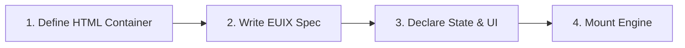

# Quick Start

In this guide, you will create a complete reactive application featuring **numeric state**, **string bindings**, **two-way input**, and **array mutations**.

---

## 🚀 The 4-Step Process



---

## Step 1: Create an HTML File

Create an `index.html` file and include the EUIX runtime:

```html
<!DOCTYPE html>
<html lang="en">
<head>
  <meta charset="UTF-8">
  <meta name="viewport" content="width=device-width, initial-scale=1.0">
  <title>EUIX Quickstart</title>
  <!-- Tailwind CSS for styling (optional) -->
  <script src="https://cdn.tailwindcss.com"></script>
  <!-- EUIX Engine UMD bundle -->
  <script src="https://unpkg.com/euixjs/dist/EUIXEngine.umd.js"></script>
</head>
<body class="bg-slate-50 min-h-screen flex items-center justify-center p-6">
  <!-- Target DOM Mount Container -->
  <div id="app" class="w-full max-w-md"></div>

  <!-- Declarative Application Script -->
  <script type="application/euix" target="#app">
  <uid_spec>
    <!-- 1. Reactive State Definition -->
    <data_model>
      <state id="username" type="string">Alex</state>
      <state id="counter" type="number">0</state>
      <state id="items" type="array">[{"id": 1, "text": "Explore EUIX Engine"}]</state>
    </data_model>

    <!-- 2. Declarative Layout & Bindings -->
    <flex direction="column" gap="16" class="p-6 bg-white rounded-2xl shadow-xl border border-slate-100">
      
      <!-- Interpolated Text & Property Access -->
      <div>
        <h1 class="text-xl font-bold text-slate-800">Hello, {data.username}!</h1>
        <p class="text-sm text-slate-500">Current count: <span class="font-bold text-blue-600">{data.counter}</span></p>
      </div>

      <!-- Two-Way Form Binding -->
      <flex direction="column" gap="4">
        <label class="text-xs font-semibold text-slate-600 uppercase">Change Name:</label>
        <input 
          bind="username" 
          placeholder="Enter your name..." 
          class="px-3 py-2 border border-slate-200 rounded-lg text-sm focus:outline-blue-500" 
        />
      </flex>

      <!-- Event Listeners with SET_STATE Action -->
      <flex direction="row" gap="8">
        <button class="flex-1 py-2 bg-blue-600 hover:bg-blue-700 text-white font-medium rounded-lg text-sm transition-colors cursor-pointer">
          <on_click action="SET_STATE">
            <path>data.counter</path>
            <value>{data.counter + 1}</value>
          </on_click>
          +1 Count
        </button>
        <button class="flex-1 py-2 bg-slate-200 hover:bg-slate-300 text-slate-700 font-medium rounded-lg text-sm transition-colors cursor-pointer">
          <on_click action="SET_STATE">
            <path>data.counter</path>
            <value>0</value>
          </on_click>
          Reset
        </button>
      </flex>

      <!-- List Rendering with Keyed Reconciliation -->
      <flex direction="column" gap="8" class="pt-4 border-t border-slate-100">
        <h3 class="text-xs font-bold text-slate-400 uppercase tracking-wider">Items ({data.items.length})</h3>
        
        <for_each items="{data.items}" var="item" key="id">
          <flex direction="row" justify="between" align="center" class="p-2.5 bg-slate-50 rounded-lg border border-slate-100">
            <span class="text-sm text-slate-700">{item.text}</span>
            <button class="text-xs text-rose-500 hover:text-rose-700 font-semibold px-2 py-1">
              <on_click action="MUTATE_STATE">
                <path>items</path>
                <operation>REMOVE</operation>
                <where field="id" equals="{item.id}" />
              </on_click>
              Delete
            </button>
          </flex>
        </for_each>
      </flex>
    </flex>
  </uid_spec>
  </script>
</body>
</html>
```

---

## Step 2: Open in Browser

Serve the folder with any static web server (e.g. `npx serve .`, `python3 -m http.server`, or Vite) or open `index.html` directly in your browser.

When you interact with the UI:
1. Typing in the input field updates `data.username` in real-time, instantly reflecting in `<h1>Hello, {data.username}!</h1>`.
2. Clicking **+1 Count** increments `data.counter` mathematically without string concatenation.
3. Clicking **Delete** removes the item from the `items` array and reconciles the DOM list efficiently.

---

## 🧭 Next Step

Explore the **[Mental Model](/getting-started/mental-model)** to understand how EUIX orchestrates state reactivity, expression parsing, and targeted DOM updates.
