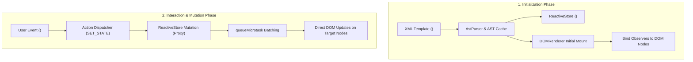

# The EUIX Mental Model

To use EUIX effectively, it helps to understand how it differs from traditional JavaScript frameworks.

---

## 🔄 The EUIX Execution Flow



---

## 1. Virtual DOM vs Direct DOM Updates

Most contemporary frontend libraries (like React or Vue without fine-grained reactivity) work with a **Virtual DOM**:

```text
[Virtual DOM Model]
State Changes ──► Re-render Entire Virtual Tree ──► Diff Old vs New VDOM ──► Patch Changes to DOM
```

In contrast, EUIX employs **Fine-Grained Direct DOM Updates**:

```text
[EUIX Direct DOM Model]
State Changes ──► Identify Dependent DOM Nodes ──► Directly Mutate Target Nodes
```

When you define a binding like `<span>{data.user_name}</span>`:
1. During initial mount, EUIX records that this specific text node depends on the `user_name` state key.
2. When `data.user_name` changes, EUIX immediately updates `node.textContent = newValue`.
3. No other elements, parents, or siblings are touched or re-evaluated.

---

## 2. The Role of the Markup Parser (`AstParser`)

EUIX parses the XML specification into an abstract syntax tree (AST). 

- **AST Caching**: When multiple instances of the same component or template are rendered, EUIX reuses the cached AST from its LRU cache (`_astCache`) rather than re-parsing the XML string.
- **Zero-Allocation Expression Evaluation**: Dynamic expressions like `{data.counter + 1}` or `{task.done ? 'done' : 'pending'}` are transpiled once into optimized JavaScript evaluator functions and cached.

---

## 3. The Reactive Store (`<data_model>`)

State in EUIX is held in a centralized reactive store backed by JavaScript `Proxy` objects:

- **Type Awareness**: Explicit types (`type="number"`, `type="boolean"`, `type="array"`, `type="object"`) ensure that arithmetic operations evaluate numerically (e.g. `0 + 1 = 1`, not `"01"`).
- **Mutation Batching**: Rapid sequential mutations are batched using `queueMicrotask`. If you modify state 10 times in a single synchronous function call, dependent DOM nodes are updated only once on the next microtask tick.

---

## 4. Declarative Actions & Event Delegation

Instead of attaching thousands of individual event listeners to repeated elements:
- In `<for_each>` loops, EUIX uses **container-level event delegation**. A single event listener on the parent handles clicks from all rows, looking up the clicked item from an internal WeakMap or element context.
- Actions can be declarative (`<on_click action="SET_STATE">`), composed workflows (`<action_def>`), or sandboxed JavaScript routines (`action="RUN_SCRIPT"`).

---

## 🧭 Next Section: Core Concepts

Now that you understand the foundational mental model, let's explore **[State Management](/core-concepts/state)** in detail.
