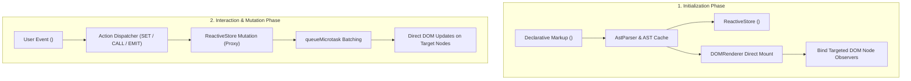

# The EUIX Mental Model

EUIX is built around a single unifying principle:

> **Make EUIX minimal by default and powerful by opt-in.**  
> A lightweight reactive declarative UI runtime that turns markup + state + events into DOM updates without requiring a build step or a virtual DOM.

A developer can master EUIX by learning roughly **5 foundational concepts**:

```text
EUIX
├── 1. State (<data_model>)
├── 2. Templates
│   ├── Expressions ({data.user})
│   ├── Conditions (show="{...}" / <if>)
│   └── Iteration (<for_each items="{...}" var="item" key="id">)
├── 3. Events / Actions (SET, TOGGLE, CALL, EMIT, engine.action)
├── 4. Components (<component_def>, props, slots)
└── 5. Plugins (.use(plugin) for opt-in capabilities)
```

---

## 🔄 The EUIX Execution Flow



---

## 1. Virtual DOM vs Direct DOM Updates

Traditional frontend frameworks (like React or Vue without fine-grained reactivity) rely on a **Virtual DOM**:

```text
[Virtual DOM Model]
State Changes ──► Re-render Entire Virtual Tree ──► Diff Old vs New VDOM ──► Patch Changes to DOM
```

In contrast, EUIX employs **Fine-Grained Direct DOM Updates**:

```text
[EUIX Direct DOM Model]
State Changes ──► Identify Dependent DOM Nodes ──► Directly Mutate Target Nodes
```

When you define a binding like `<span>{data.user_name}</span>`:
1. During initial mount, EUIX records that this specific text node depends on the `user_name` state key.
2. When `data.user_name` changes, EUIX immediately updates `node.textContent = newValue`.
3. No other elements, parents, or siblings are touched or re-evaluated.

---

## 2. Declarative Templates: Expressions, Conditions & Iteration

EUIX templates are standard HTML or XML enhanced with three reactive primitives:
- **Expressions**: Single-pass transpiled JIT expressions like `{data.counter + 1}` or `{task.done ? 'line-through' : ''}` evaluate reactively with AST caching.
- **Conditions**: Toggle element visibility reactively via `show="{data.isOpen}"` or `<if test="{data.isLoggedIn}">`.
- **Iteration**: Render dynamic arrays with `<for_each items="{data.items}" var="item" key="id">` featuring container-level event delegation and keyed DOM reconciliation.

---

## 3. Simple Actions with JavaScript Escape Hatches

EUIX embraces declarative actions for common UI state updates without becoming a programming language in XML:
- **`SET` / `SET_STATE`**: Update state (`on_click:set="count={data.count + 1}"` or `<on_click action="SET_STATE">`).
- **`TOGGLE`**: Flip boolean values (`on_click:toggle="isOpen"`).
- **`CALL`**: Invoke registered JavaScript functions (`<on_click action="saveUser" />` or `on_click:call="saveUser"` with `engine.action("saveUser", fn)`).
- **`EMIT`**: Dispatch native custom events or hook triggers (`on_click:emit="task:completed"`).
- **`RUN` / `RUN_SCRIPT`**: Sandboxed inline JavaScript escape hatch for rapid zero-build experimentation.

Complex business logic belongs cleanly in JavaScript, not complex XML scripts.

---

## 4. Components, Props & Slots

Encapsulate reusable UI patterns with:
- `<component_def name="user-card">`: Define reusable templates.
- **Props**: Pass reactive data down via `{props.title}` or `{props.user}`.
- **Slots**: Project children or use scoped slots (`<slot name="header">`, `<template slot="item" let="s">`).

---

## 5. Modular Opt-In Plugins (`.use(plugin)`)

Core EUIX remains ultra-lightweight. Advanced capabilities are opt-in plugins that developers import only when needed:
- **`euixjs/api`**: REST API client with SWR caching, offline queueing, and revalidation.
- **`euixjs/router`**: Web router with route matching and nested outlet rendering.
- **`euixjs/composer`**: Multi-step action workflows and resilience pipelines.
- **`euixjs/storage`**: LocalStorage and SessionStorage persistence.
- **`euixjs/devtools`**: Visual DevTools inspector panel.
- **Ecosystem Integrations**: Leaflet maps, SVG charts, animations, and WebMCP browser AI tools.

---

## 🧭 Next Section: Core Concepts

Now that you understand the foundational 5-concept model, explore **[State Management](/core-concepts/state)** to get started building.
