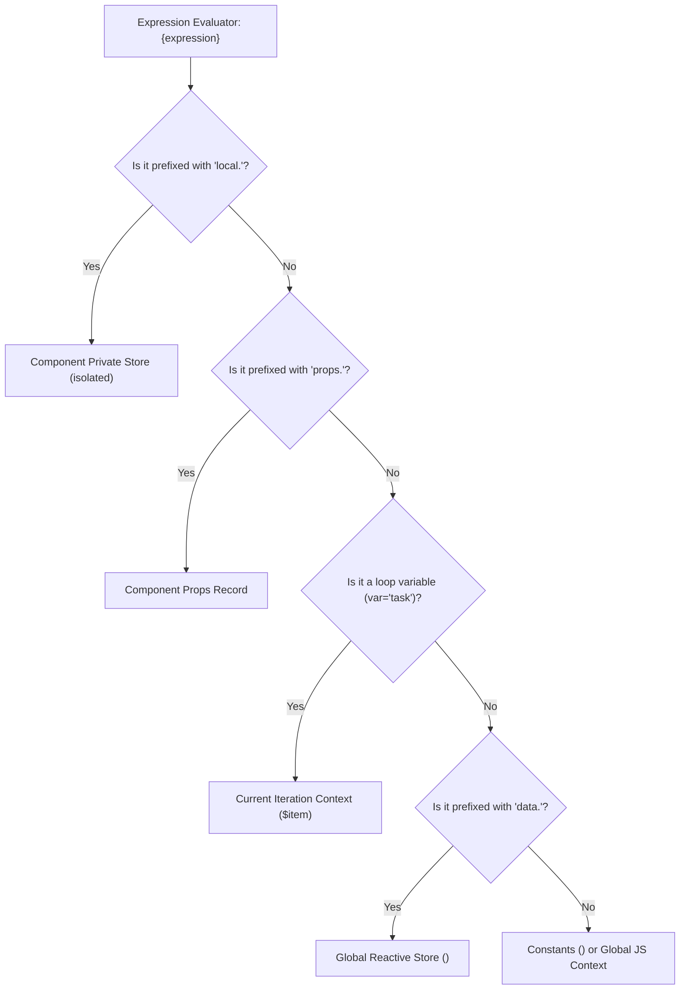

# Scoping & State Isolation

EUIX provides a dual-mode state scoping model, allowing you to share global application state or encapsulate private state within individual component instances.

---

## 🌐 1. Global Shared State (`<data_model>`)

By default, state defined in the root `<data_model>` is accessible globally across all components and templates via `{data.key}`:

```xml
<data_model>
  <state id="theme">dark</state>
  <state id="currentUser">Alice</state>
</data_model>
```

---

## 🔒 2. Component-Scoped Isolation (`isolated="true"`)

For multi-instance UI widgets (like tabs, accordions, counters, or modals) where each instance must maintain independent internal state, set `isolated="true"` on the `<component_def>`:

```xml
<!-- Independent Counter Component -->
<component_def name="isolated-counter" isolated="true">
  <data_model>
    <!-- Private state unique to EACH rendered instance -->
    <state id="clicks" type="number">0</state>
  </data_model>

  <div class="p-3 bg-slate-50 border rounded-lg flex items-center justify-between">
    <span>{props.label}: <strong>{local.clicks}</strong></span>
    
    <button class="px-3 py-1 bg-blue-600 text-white rounded text-xs">
      <on_click action="SET_STATE">
        <path>local.clicks</path>
        <value>{local.clicks + 1}</value>
      </on_click>
      +1
    </button>
  </div>
</component_def>
```

```xml
<!-- Multiple instances maintain their own private click count -->
<component name="isolated-counter" label="Counter A" />
<component name="isolated-counter" label="Counter B" />
<component name="isolated-counter" label="Counter C" />
```

> [!TIP]
> Notice the **`local.`** prefix (e.g. `{local.clicks}`). This guarantees mutations affect only the specific component instance that triggered the event.

---

## 🔄 3. Loop Item Scope (`<for_each var="...">`)

Inside `<for_each items="{data.items}" var="task">`, the variable `task` is scoped to the current iteration:

```xml
<for_each items="{data.tasks}" var="task">
  <div>
    <!-- Directly access loop item properties -->
    <span>{task.title}</span>
    <!-- Global state can still be accessed via data. -->
    <small>Current theme: {data.theme}</small>
  </div>
</for_each>
```

---

## 🌳 Variable Resolution Hierarchy



---

## 🧭 Next Step

Explore component mount, unmount, and update hooks in **[Lifecycle Hooks](/components/lifecycle)**.
