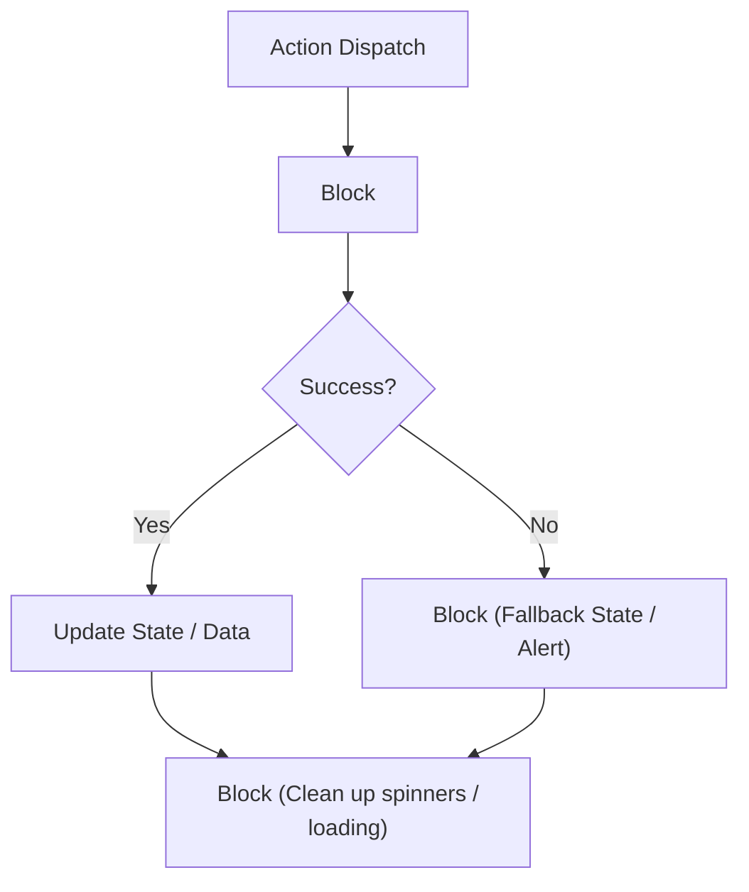

# Error Handling & Resilience

EUIX provides declarative error handling and resilience pipelines via the **Resilience Plugin** (`euixjs/resilience`) and **Action Composer** (`euixjs/composer`).

---

## 🛡️ The Try / Catch / Finally Pipeline

You can wrap fragile operations (like network requests or complex data mutations) in declarative try/catch pipelines:



```xml
<step action="TRY">
  <try>
    <step action="XHR">
      <url>https://api.example.com/sensitive-data</url>
      <target>data.payload</target>
      <timeout ms="4000" />
      <retry max="3" backoff="exponential" />
    </step>
  </try>
  
  <catch>
    <step action="SET_STATE">
      <path>data.errorMessage</path>
      <value>Unable to retrieve data. Please try again later.</value>
    </step>
  </catch>
  
  <finally>
    <step action="SET_STATE">
      <path>data.isLoading</path>
      <value>false</value>
    </step>
  </finally>
</step>
```

---

## ⚙️ Resilience Capabilities

- **Timeouts (`<timeout ms="5000" />`)**: Automatically aborts long-hanging network requests or asynchronous tasks.
- **Exponential Retry (`<retry max="3" backoff="exponential" />`)**: Retries failed network requests with progressive delay increments.
- **Circuit Breaker**: Prevents repeated request flooding when a remote service is continuously returning 5xx errors.

---

## 🧭 Next Step

Learn about using JavaScript as an escape hatch in **[RUN_SCRIPT & Sandboxing](/actions/run-script)**.
