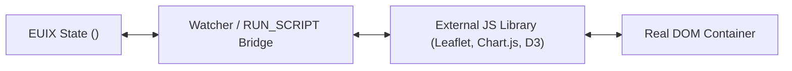

# Integrating JavaScript Libraries

One of EUIX's greatest strengths is its ability to coexist smoothly with existing JavaScript libraries. Because EUIX operates directly on real DOM nodes, connecting external libraries requires no synthetic event workarounds or virtual DOM wrappers.

---

## 🌉 Integration Pattern: Lifecycle Hooks + RUN_SCRIPT



---

## 🛠️ Step-by-Step Example: Bridging an External Library

```xml
<uid_spec>
  <data_model>
    <state id="gaugeValue" type="number">75</state>
  </data_model>

  <flex direction="column" gap="12" class="p-6">
    <!-- 1. Real DOM Canvas Container -->
    <canvas id="myGauge" width="200" height="200"></canvas>

    <!-- 2. Mount Lifecycle: Initialize Library Instance -->
    <on_mount action="RUN_SCRIPT">
      const ctx = document.getElementById('myGauge').getContext('2d');
      $data._gauge = new ExternalGauge(ctx, { value: $data.gaugeValue });
    </on_mount>

    <!-- 3. State Watcher: Sync State Changes to Library -->
    <on_state_change key="gaugeValue" action="RUN_SCRIPT">
      if ($data._gauge) {
        $data._gauge.setValue($data.gaugeValue);
      }
    </on_state_change>

    <!-- 4. Unmount Lifecycle: Destroy Library Instance -->
    <on_unmount action="RUN_SCRIPT">
      if ($data._gauge) {
        $data._gauge.destroy();
        $data._gauge = null;
      }
    </on_unmount>

    <!-- UI Control -->
    <input type="range" min="0" max="100" bind="gaugeValue" />
    <p>Value: {data.gaugeValue}%</p>
  </flex>
</uid_spec>
```

---

## 🧭 Next Step

Explore client-side routing in **[Web Router & Navigation](/guides/routing)**.
