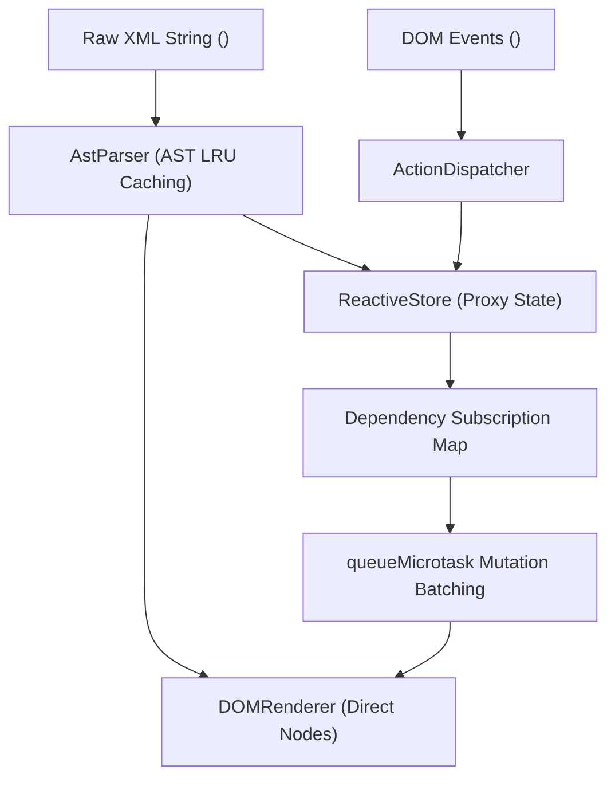

# Runtime Architecture

EUIX Engine is designed as an ultra-compact reactive kernel with deterministic direct DOM updates.

---

## 🏛️ Core Architectural Subsystems

### 1. The AST Parser (`AstParser`)
Converts raw XML templates into an in-memory Abstract Syntax Tree. Includes an LRU AST Cache to ensure identical templates and components are parsed exactly once.

### 2. The Reactive State Store (`ReactiveStore`)
Wraps application state in JavaScript `Proxy` instances. When properties are accessed during initial rendering, EUIX records a fine-grained subscription mapping state keys to specific DOM nodes.

### 3. Microtask Mutation Batcher (`queueMicrotask`)
Prevents thrashing by batching multiple synchronous state mutations in the same JavaScript execution frame into a single DOM update pass.

### 4. The Direct DOM Reconciler (`DOMRenderer`)
Directly manipulates real browser DOM elements (`node.textContent = ...`, `element.setAttribute(...)`, `element.classList.toggle(...)`) without creating virtual DOM representations or performing full-tree diffing.

---

## 🧭 Next Steps

- Explore the foundational design and native porting roadmap in **[Philosophy & Multi-Platform Vision](/advanced/philosophy-and-multiplatform)**.
- Read about performance benchmarks in **[Performance & Benchmarks](/advanced/performance)**.
