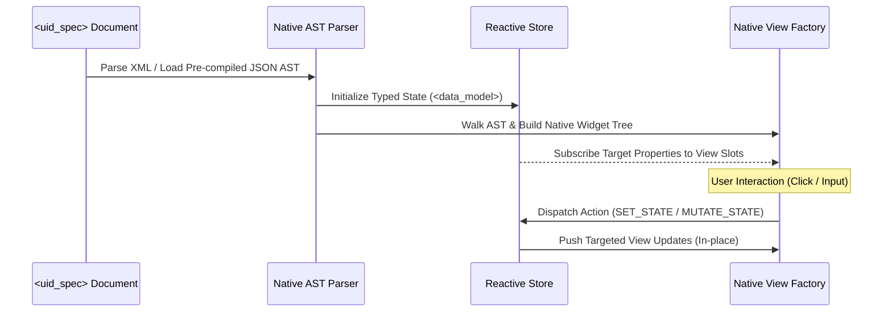

# Philosophy & Multi-Platform Vision

EUIX Engine was created with a fundamental realization: **User interfaces should be universal, declarative data specifications rather than tightly coupled, framework-locked JavaScript bundles.**

While modern web development has largely standardized on complex compiler pipelines (JSX, SFCs, heavy bundlers) and Virtual DOM runtimes, EUIX decouples the **UI contract (`<uid_spec>`)** and **reactive state model (`<data_model>`)** from the underlying rendering layer.

---

## 🏛️ 1. The Core Philosophy of EUIX

```
                                +-------------------------------------------------------+
                                |             EUIX Specification (<uid_spec>)           |
                                |     Declarative Markup, State Model & Actions         |
                                +-------------------------------------------------------+
                                                            |
                                                            v
                                +-------------------------------------------------------+
                                |            Core Reactive State Engine (AST)           |
                                |    Bitmask Dirty Checking & Dependency Subscriptions  |
                                +-------------------------------------------------------+
                                                            |
                     +----------------------+---------------+-----------------------+----------------------+
                     |                      |                                       |                      |
                     v                      v                                       v                      v
          +--------------------+ +--------------------+                   +--------------------+ +--------------------+
          |    Browser DOM     | |    iOS SwiftUI     |                   |  Android Compose   | |   Rust / Desktop   |
          |  (DOMRenderer.js)  | |  (Swift UI Engine) |                   |  (Kotlin Engine)   | |  (Slint / Skia)    |
          +--------------------+ +--------------------+                   +--------------------+ +--------------------+
```

### 1. UI as a Universal Declarative Protocol
UI templates should be portable, serializable, and human-readable data structures. By using standard XML/HTML schemas (`<uid_spec>`, `<flex>`, `<grid>`, `<data_model>`, `<action_def>`), any software, backend system, or AI agent can produce and consume user interfaces without executing arbitrary untrusted code or requiring massive compilation toolchains.

### 2. Zero Virtual DOM & Fine-Grained Reactive Execution
Instead of re-executing entire component functions and diffing heavy Virtual DOM trees, EUIX connects state variables directly to targeted nodes. State changes trigger bitmask dirty-checking and microtask-batched updates directly on subscribed views.

### 3. Separation of Concerns: Specification vs. Engine vs. Renderer
The architecture cleanly separates three layers:
1. **The Specification Layer:** Defines the AST, data types, layout attributes, and action subroutines.
2. **The Reactive Core:** Manages state mutations, dependency graphs, computed values, watchers, and transaction batching.
3. **The Renderer Backend:** Translates the reactive AST into platform-native display elements (Browser DOM, SwiftUI views, Jetpack Compose composables, or Skia canvas widgets).

### 4. AI-Agent & Autonomous System Friendly
Large Language Models (LLMs) and autonomous agents excel at generating structured, schema-validated XML markup. EUIX provides a deterministic, hallucination-resistant format that AI agents can generate and inspect safely within sandboxed execution environments.

---

## 🌍 2. Multi-Platform & Native Porting Vision

Because the `<uid_spec>` template and reactive state machine are completely independent of web-specific concepts (like `window` or `document`), the EUIX architecture can be ported to native platforms.

### Target Platforms & Implementation Roadmap

| Platform | Target Runtime / UI Framework | Core Engine Implementation | Target Render Output |
|---|---|---|---|
| **Web & PWA** | Web Standards / ESM / UMD | JavaScript (`EUIXEngineCore.js`) | Direct HTML5 DOM nodes |
| **iOS / iPadOS / macOS** | Swift & SwiftUI | Swift / C++ Reactive Core | Native `VStack`, `HStack`, `Button`, `Text` |
| **Android** | Kotlin & Jetpack Compose | Kotlin / C++ Reactive Core | `@Composable` `Column`, `Row`, `Button`, `Text` |
| **Desktop (Cross-Platform)** | Rust & Slint / Skia / Tauri | Rust Native Core | Native OS Windows, Skia Render Tree |
| **Terminal & CLI (TUI)** | Go / Rust (Bubble Tea / Ratatui) | Go / Rust Reactive Core | ANSI Terminal widgets, interactive tables |
| **Embedded & IoT Devices** | C / MicroPython / WASM | Embedded C (<30KB footprint) | Microcontroller LCD / OLED framebuffers |

---

## 🗺️ 3. Universal Tag Mapping Across Platforms

The declarative tags of EUIX map directly to the native layout primitives of every major UI platform:

| EUIX Specification Tag | Browser DOM | iOS SwiftUI | Android Jetpack Compose | Desktop (Slint / Rust) | Terminal (TUI) |
|---|---|---|---|---|---|
| `<flex direction="column">` | `<div style="display:flex; flex-direction:column">` | `VStack(spacing: ...)` | `Column(verticalArrangement = ...)` | `VerticalBox { ... }` | `lipgloss.JoinVertical(...)` |
| `<flex direction="row">` | `<div style="display:flex; flex-direction:row">` | `HStack(spacing: ...)` | `Row(horizontalArrangement = ...)` | `HorizontalBox { ... }` | `lipgloss.JoinHorizontal(...)` |
| `<button>` | `<button>` | `Button(action: ...) { ... }` | `Button(onClick = ...) { ... }` | `Button { clicked => ... }` | Interactive focusable button |
| `<input bind="..." />` | `<input />` | `TextField(text: $state)` | `OutlinedTextField(value = state)` | `LineEdit { text <=> state }` | `textinput.Model` |
| `<for_each items="{data.list}">` | `ForEachRenderer` | `ForEach(data.list) { item in ... }` | `LazyColumn { items(data.list) { ... } }` | `for item in data.list: ...` | List viewport pagination |
| `<collapse>` | `<details>` or custom accordion | `DisclosureGroup(...) { ... }` | `AnimatedVisibility(...) { ... }` | Collapsible section container | Expandable tree branch |
| `<dialog>` | `<dialog>` / modal overlay | `.sheet(...)` or `.alert(...)` | `Dialog(onDismissRequest = ...)` | Native OS Dialog / Modal | Floating TUI modal overlay |

---

## ⚡ 4. Native Engine Architecture Blueprint

When implementing a native EUIX runtime (e.g. in Swift or Rust), the architecture follows three core phases:



### 1. Native AST Parser & Serializer
Parses the `<uid_spec>` XML string or loads a pre-compiled JSON AST generated by `AstParser.serializeAst()`.

### 2. Native Reactive State Model
Implements observable properties:
- In **Swift**: Uses Swift 5.9+ `@Observable` macro or `Combine` publishers.
- In **Kotlin**: Uses Jetpack Compose `mutableStateOf()` and `SnapshotStateList`.
- In **Rust**: Uses lightweight signal primitives (e.g. `leptos_reactive` or custom slot listeners).

### 3. Native Event Action Dispatcher
Dispatches actions declaratively:
- `<on_click action="SET_STATE">` triggers type-safe in-memory state mutations.
- `<on_click action="REVALIDATE_API">` executes native HTTP client requests (`URLSession`, `Ktor`, `reqwest`) and binds responses directly to state models.

---

## 🔮 5. The Future: A Single UI Language for Every Screen

By standardizing on a clean declarative XML specification with zero framework overhead, EUIX opens the door to a truly unified interface ecosystem:
- **Write once in `<uid_spec>`**: Render seamlessly on the web, compile into native mobile apps, run inside terminal consoles, and power lightweight IoT displays.
- **Agentic Collaboration**: AI coding assistants and automation pipelines can generate full multi-platform interfaces with verified schemas, zero syntax drift, and instant native performance.
