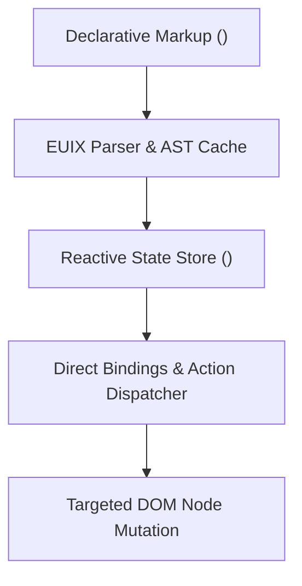

# EUIX Engine

> **Declarative interfaces without a virtual DOM.**  
> Define state, components, and interactions directly in markup, then let EUIX update the DOM when data changes.

<div style="display: flex; gap: 12px; margin: 24px 0;">
  <a href="/getting-started/introduction" style="padding: 10px 20px; background: #2563eb; color: #fff; border-radius: 8px; font-weight: 600; text-decoration: none;">Get Started</a>
  <a href="https://github.com/litepacks/euix" target="_blank" rel="noopener noreferrer" style="padding: 10px 20px; background: #334155; color: #fff; border-radius: 8px; font-weight: 600; text-decoration: none;">View on GitHub</a>
</div>

---

## ⚡ Working Example

Here is a minimal, complete EUIX application. You declare your data model and interactive elements inside a standard XML specification:

```xml
<uid_spec>
  <!-- 1. Declare reactive state with explicit types -->
  <data_model>
    <state id="count" type="number">0</state>
  </data_model>

  <!-- 2. Bind interactions and expressions directly to the DOM -->
  <flex direction="column" gap="12" class="p-6 bg-white rounded-xl shadow-lg border border-slate-100 max-w-sm">
    <h2 class="text-xl font-bold text-slate-800">Count: {data.count}</h2>
    
    <button class="px-4 py-2 bg-blue-600 hover:bg-blue-700 text-white font-medium rounded-lg transition-colors cursor-pointer">
      <on_click action="SET_STATE">
        <path>data.count</path>
        <value>{data.count + 1}</value>
      </on_click>
      Increment Counter
    </button>
  </flex>
</uid_spec>
```

```html
<!-- Mount in your HTML page -->
<div id="app"></div>

<script src="https://unpkg.com/euixjs/dist/EUIXEngine.umd.js"></script>
<script>
  EUIXEngine.mount(xmlString, document.getElementById('app'));
</script>
```

---

## 🧠 How EUIX Works

EUIX connects declarative markup directly to the live DOM tree without compiling to a virtual DOM or running an expensive full-tree diff cycle.



1. **Reads Declarative Markup**: EUIX parses XML/HTML markup into an optimized AST representation.
2. **Registers State**: State variables in `<data_model>` are registered in a fine-grained Proxy store.
3. **Connects Bindings & Watchers**: DOM elements register subscribers only for the specific state keys they reference.
4. **Dispatches Actions**: User events trigger declarative actions (`SET_STATE`, `MUTATE_STATE`, `XHR`) or sandboxed scripts.
5. **Direct DOM Updates**: When a state value changes, only the exact DOM nodes subscribing to that state key update directly in place.

---

## ⚖️ Why EUIX? (Balanced Tradeoffs)

EUIX is built for developers who want declarative reactivity without the complexity of large single-page application (SPA) toolchains.

### EUIX is a great fit for:
- **Small to medium interactive pages** that need reactive state without megabytes of JavaScript.
- **Admin dashboards & internal tools** requiring rapid prototyping and straightforward XML UI declarations.
- **Server-rendered HTML enhancement** where interactive widgets coexist with existing backend templates.
- **Embedded widgets & microsites** where bundle size and zero-configuration mounting are critical.
- **AI Agent-generated user interfaces** (LLMs generate structured XML deterministically without syntax hallucination).

### You may prefer another tool (React, Vue, Svelte) when:
- You need a mature ecosystem of thousands of third-party component libraries (e.g. Radix, MUI).
- Your application requires complex client-side state machines across hundreds of deeply nested routes.
- Your engineering team is heavily standardized on JSX/TypeScript component authoring workflows.
- You require compile-time type checking across complex deeply nested UI templates.

---

## 🧭 Explore the Documentation

- **[Introduction](/getting-started/introduction)**: Core philosophy and what makes EUIX unique.
- **[Quick Start](/getting-started/quickstart)**: Create and mount your first reactive app in under 2 minutes.
- **[Mental Model](/getting-started/mental-model)**: Deep dive into the reactivity and execution flow.
- **[Core Concepts](/core-concepts/state)**: State, bindings, events, computed values, watchers, and forms.
- **[Components](/components/components)**: Modular UI definition, props, slots, and state isolation.
- **[Actions](/actions/actions)**: Declarative workflows, Action Composer, and sandboxed scripts.
- **[Plugins](/plugins/plugin-system)**: Tree-shakeable extensions for REST SWR, Storage, Dialog, Maps, and WebMCP AI agents.
- **[API Reference](/reference/markup)**: Complete, searchable reference for tags, directives, and runtime methods.
