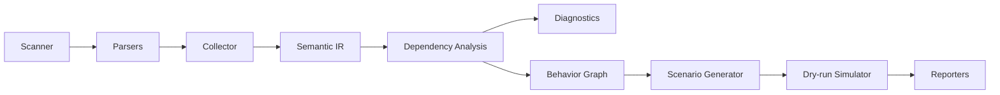

# @euix/doctor

EUIX Doctor statically analyzes EUIX applications in `.xml`, `.html`, and JavaScript/TypeScript files. Before you run the app, it discovers state/computed/watcher relationships, event → action flows, API calls, and potential reactive loops — then generates safe test scenarios.

> **Goal:** Answer “it looks like it works, but why?” in EUIX projects without entering the runtime.

---

## What it does

| Capability | Description |
|------------|-------------|
| **Semantic IR** | Extracts components, states, computed values, watchers, actions, events, bindings, routes, and API calls from XML/HTML/JS sources |
| **Dependency graph** | Builds read/write/dependency edges; detects computed and watcher cycles |
| **Diagnostics** | Reports unused state, missing handlers, missing API error paths, and more |
| **Behavior graph** | Models event → action → state → computed → binding flows as visualizable paths |
| **Safe test generation** | Produces dry-run simulation scenarios without touching the real DOM or network |
| **Health score** | Computes a project health score from diagnostic count, behavior coverage, and risk metrics |

Doctor is a **linter + static analyzer + lightweight simulator**. It does not replace Playwright or Vitest; it provides a fast safety net before them.

---

## Architecture

The analysis pipeline runs as a one-way flow:



### 1. Scanner (`src/scanner/`)

Discovers source files from the project root or a target path:

- `.xml`, `.html`, `.htm`
- `.js`, `.mjs`, `.cjs`, `.ts`, `.tsx`, `.jsx`

Directories such as `node_modules`, `dist`, and `build` are skipped automatically.

### 2. Parsers (`src/parser/`)

| Parser | Library | Role |
|--------|---------|------|
| `xml.ts` | htmlparser2 | Parses the EUIX XML/HTML tree |
| `oxc.ts` | oxc-parser | Finds template literals in JS/TS files |
| `expressions.ts` | — | `{data.x}`, event attributes, action body analysis |

`euix\`...\`` blocks and `<uid_spec>` sections inside HTML are processed as separate XML documents.

### 3. Collector (`src/euix/collector.ts`)

Extracts **Semantic IR** entities from the parsed tree:

- `<state>`, `<computed>`, `<watch>`
- `<action>`, `<action_def>` (step/param/return)
- Event handlers such as `<on_click>`, `on_click:set`, `@click`
- `bind` and `{data.x}` text bindings
- `<route>`, `<component_def>`, `<slot>`, `<param>`
- `<api_endpoint>`, `<api_stream>` (REST + WebSocket/SSE)

### 4. IR & Project (`src/ir/`)

All entities live in typed Maps inside `EuixProject`:

```
EuixProject
├── components, states, computed, watchers
├── actions, events, bindings
├── props, slots, routes, apiCalls
├── dependencies[]   ← edges after analysis
└── diagnostics[]    ← rule violations
```

### 5. Analysis (`src/analysis/`)

- **dependencies.ts** — state read/write edges, computed/watcher cycle detection
- **risk.ts** — component/action complexity, health score

### 6. Diagnostics (`src/diagnostics/`)

Static rules are evaluated. Key rules:

| Rule | Level | Meaning |
|------|-------|---------|
| `EUIX1001` | error | Action writes to an unknown state |
| `EUIX1002` | warning | State is never used |
| `EUIX1101` | error | Computed dependency cycle |
| `EUIX1102` | error | Computed references an unknown dependency |
| `EUIX1201` | warning | Watcher writes its own path (reactive loop) |
| `EUIX1301` | error | Custom action not defined (built-ins, shorthands, imported `<action_def>` recognized) |
| `EUIX1302` | error | Plugin action used without matching plugin markup/import |
| `EUIX1401` | error | Component reference could not be resolved |
| `EUIX1402` | error | Missing required prop on child component |
| `EUIX1403` | error | Prop `type` or `enum` mismatch (inferred) |
| `EUIX1501` | warning | Missing API error path (loading state may stay stuck) |

### 7. Behavior Graph (`src/graph/`)

Starting from event triggers, extracts action → state write → computed recompute → binding update chains as `BehaviorPath` objects. The `--graph` and `--flows` flags print this data to the terminal.

### 8. Scenarios & Simulator (`src/scenarios/`, `src/runner/`)

Uses a **dry-run simulator** instead of the real runtime:

- **smoke** — can the component be parsed, are entity counts consistent
- **flow** — event → action → state change simulation (e.g. `count 0 → 1`)
- **api** — 200/404/500/network failure scenarios (no real fetch)

Use `--fuzz` to add semantic fuzz scenarios.

### 9. Reporters (`src/reporters/`)

- **terminal.ts** — human-readable summary
- **json.ts** — machine-readable output for CI

---

## Source tree

```
packages/doctor/
├── src/
│   ├── scanner/          # File discovery
│   ├── parser/           # XML, JS, expression parsing
│   ├── euix/collector.ts # IR collection
│   ├── ir/               # Type definitions and project builder
│   ├── analysis/         # Dependency and risk analysis
│   ├── diagnostics/      # Static rules
│   ├── graph/            # Behavior graph & paths
│   ├── scenarios/        # Test scenario generation
│   ├── runner/           # Dry-run simulator
│   ├── fuzz/             # Semantic fuzz
│   ├── memory/           # Memory signals (--memory)
│   ├── coverage/         # Behavior coverage metrics
│   ├── reporters/        # Terminal & JSON output
│   ├── cli/main.ts       # CLI entry point
│   └── doctor.ts         # Orchestrator
├── fixtures/             # Test and demo scenarios
│   ├── native/           # Core EUIX features
│   ├── plugins/          # Plugin tags (chart, map, stream, etc.)
│   ├── runtime/          # JS template literal scenarios
│   ├── broken/           # Intentionally broken examples
│   ├── multi-component/  # Composition scenarios
│   └── apps/             # Full HTML applications
└── tests/
```

---

## VS Code / Cursor Extension

The `euix-doctor` extension (`packages/vscode-euix-doctor`) integrates Doctor into the editor:

| Feature | Description |
|---------|-------------|
| Problems panel | `EUIX1001`–`EUIX1501` diagnostics inline in XML/HTML files (incl. composition `EUIX1401`–`EUIX1403`) |
| Analyze on save | Debounced workspace re-scan |
| Status bar | Error/warning count |
| Commands | Analyze workspace, analyze file, run safe tests |

```bash
npm run vscode-doctor:build    # build doctor + extension
npm run vscode-doctor:package  # produce .vsix
```

Press **F5** in `packages/vscode-euix-doctor` to debug locally.

---

## Usage

Doctor can be run standalone or via the `euix` CLI.

### Standalone CLI (`@euix/doctor`)

```bash
# After npm publish (or locally via npm exec)
npx @euix/doctor
npx @euix/doctor apps/playground/components --test
npx euix-doctor inspect path/to/Component.xml

# Monorepo local
npm exec -w @euix/doctor -- euix-doctor --help
```

### Via `euix` CLI (`euixjs`)

```bash
# From monorepo root
npm run doctor

# Specific directory or file
npx euix doctor apps/playground/components
node packages/core/bin/euix.js doctor packages/doctor/fixtures
```

### Run generated test scenarios

```bash
node packages/core/bin/euix.js doctor packages/doctor/fixtures --test
```

### Behavior graph and flows

```bash
node packages/core/bin/euix.js doctor apps/playground --flows --graph
```

### Inspect a single file

```bash
node packages/core/bin/euix.js doctor inspect packages/doctor/fixtures/simple-component.xml
```

### JSON output (CI)

```bash
node packages/core/bin/euix.js doctor . --json > doctor-report.json
```

### All flags

```
--test           Run generated safe test scenarios
--flows          Show behavior paths
--graph          Show behavior graph summary
--memory         Collect memory signals during tests
--fuzz           Add semantic fuzz scenarios (requires --test)
--json           JSON output
--seed=<n>       Fuzz seed
--repeat=<n>     Memory repeat count
```

---

## Programmatic API

The package can be imported directly:

```typescript
import { buildProject, runDoctor } from "@euix/doctor";
import { buildDependencyEdges } from "@euix/doctor"; // via analysis module

const project = await buildProject("./apps/playground", "components/CounterSection.xml");
buildDependencyEdges(project);

console.log([...project.states.values()].map((s) => s.name));
console.log(project.diagnostics);
```

Full analysis pipeline:

```typescript
import { runDoctor } from "@euix/doctor";

const result = await runDoctor({
  root: process.cwd(),
  target: "apps/playground/components",
  test: true,
});

console.log(result.health.score);
console.log(result.testResults.filter((r) => !r.passed));
```

---

## Fixtures

The `fixtures/` directory is a scenario library that validates Doctor coverage:

| Group | Covered features |
|-------|------------------|
| `native/` | uid_spec, data_model, computed, watcher, router, action_def, validation, slots |
| `plugins/` | api_stream, chart, map, date, navigator, webmcp, dialog, collapse, storage, animation, retry, head |
| `runtime/` | WebSocket, EventSource, setInterval, fetch, template literal |
| `broken/` | Missing handler, watcher loop, computed cycle, prop type mismatch |
| `multi-component/` | App + Header + Dashboard composition, typed props, invalid prop scenario |

Run fixture tests:

```bash
npm run doctor:test
```

---

## Development

```bash
# Build
npm run doctor:build

# Test
npm run doctor:test

# Typecheck
npm run typecheck -w @euix/doctor
```

Typical workflow when adding a new EUIX tag or plugin support:

1. `src/euix/collector.ts` — extract IR entities from the new tag
2. `src/parser/expressions.ts` — extend action/event parsing if needed
3. `src/diagnostics/` — add a new rule
4. `fixtures/` — write an example scenario
5. `tests/` — assert expectations

---

## Nested components & imports

Doctor resolves composition **without breaking single-file analysis**:

| Feature | Support |
|---------|---------|
| `<component name="X" src="./X.xml">` | Resolves file path, auto-imports missing files |
| Custom tags (`<Header />`, `<Dashboard />`) | Matched to `component_def` / sibling `.xml` files |
| `<import src="...">`, `<route component="...">`, `<nav_item component="...">` | Recorded and linked |
| Single-file scan | Auto-discovers sibling components (e.g. scan `App.xml` → loads `Header.xml`) |
| Required props | `EUIX1402` when parent omits required child props |
| Prop types & enum | `EUIX1403` when passed value does not match `<param type="...">` or `enum` |
| Unresolved refs | `EUIX1401` when component cannot be resolved |

Prop type inference uses literal attributes (`count="42"` → `number`) and parent state bindings (`user="{data.user}"` → state's `type`). Complex expressions are skipped to avoid false positives.

Composition edges appear in the dependency graph as `composes` (parent → child).

---

## Limitations (intentional design choices)

Doctor performs **static analysis**; it does not run the real browser runtime:

- Built-in actions (`SET_STATE`, `RUN_SCRIPT`, `REVALIDATE_API`, …) and attribute shorthands (`on_click:set`, `on_click:mutate`, …) do **not** require `<action_def>` — Doctor resolves them directly
- Does not fully simulate plugin hook runtime behavior
- Data-flow inference in complex JS action bodies is limited (watch for `confidence: inferred`)
- Dynamic URLs inside template literals may be marked `unresolved`
- Does not replace E2E tests; it complements them

These limits are intentional: the goal is a fast, safe, CI-friendly first line of defense.

---

## Relationship: Doctor ↔ euixjs

```
euix-monorepo
├── packages/core (euixjs)     ← runtime engine, plugins, CLI
└── packages/doctor            ← static analysis (this package)
```

`@euix/doctor` does not depend on the `euixjs` package; it only parses EUIX markup and conventions. CLI integration is provided by the `doctor` command in `packages/core/bin/euix.js`.

---

## License

MIT — [euix monorepo](https://github.com/litepacks/euix)
